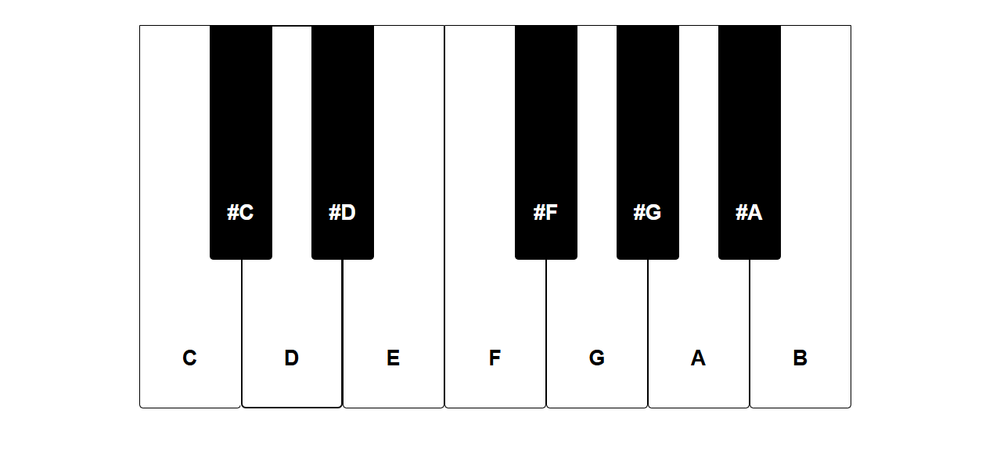

# Reto piano

Aplicacion web de un piano.

## Imagen de la aplicacion 

## Licencia

Este proyecto está bajo la [Licencia MIT](LICENSE)

> .[¡NOTE].
> Aquí tienes una nota especial

	
	<h3 align=”center”>!Hey! Soy… </h3>

> .[¡TIP].
> Aquí tienes un consejo

> .[¡IMPORTANT].
> Aquí tiene algo importante

> .[¡WARNING].
> Aquí tienes una advertencia
